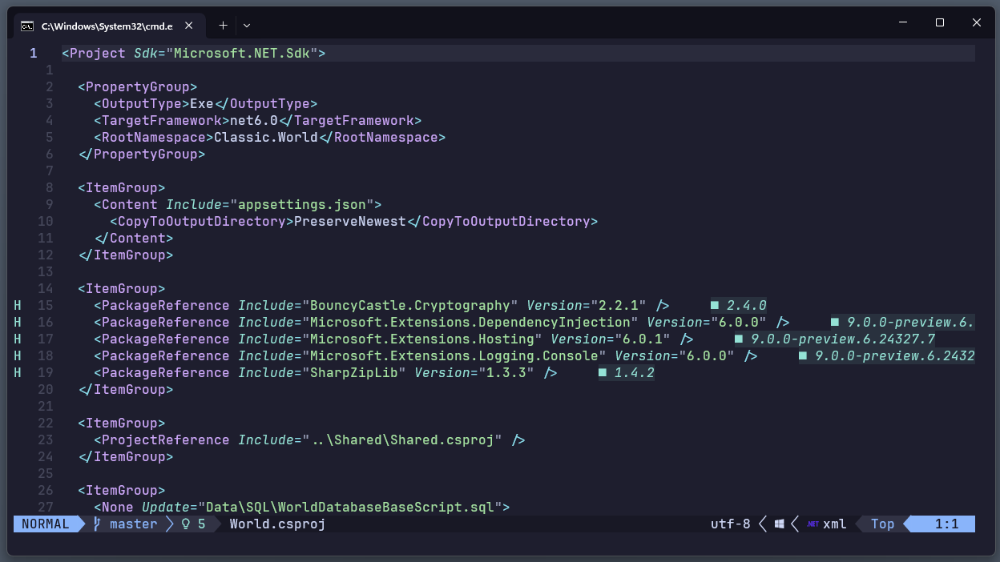

# nuget.nvim



> [!IMPORTANT]
> WORK IN PROGRESS  
> Current version only shows latest version as diagnostics after opening a `.csproj` file.
>   
> Upcoming planned features include
> - Update all NuGet packages
> - "Include prerelease" toggle
> - `nuget.config` support
> - Autocompletion for package versions while editing `.csproj` files
> - Manage packages solution-wide (similar to Visual Studio)

**Setup Example (using [lazy.nvim](https://github.com/folke/lazy.nvim))**:
```lua
{
  'Speiser/nuget.nvim',
  config = function()
    require('nuget').setup()
  end,
  dependencies = {
    'nvim-lua/plenary.nvim',
  },
}
```
